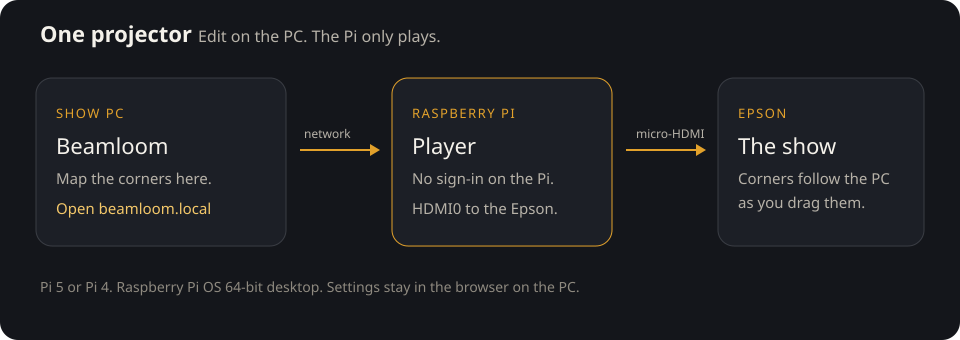
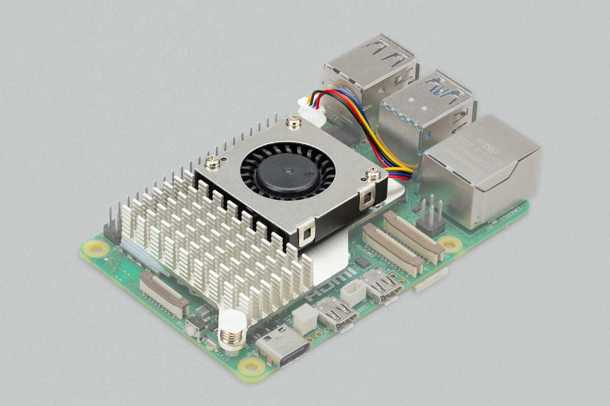
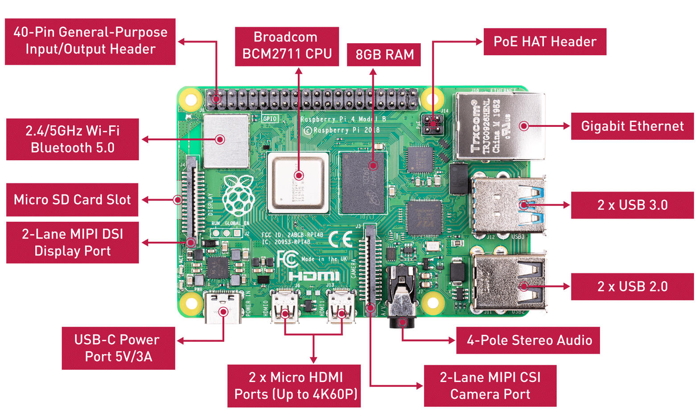
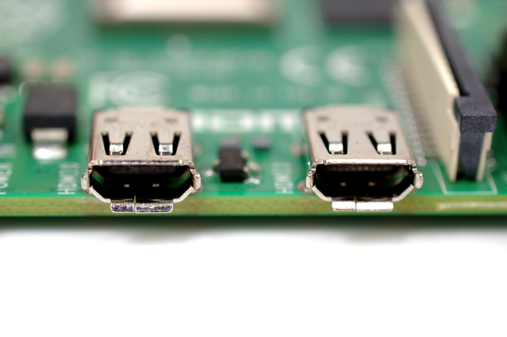
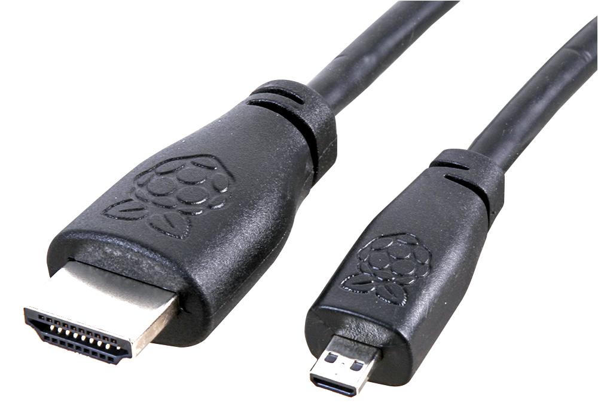

<p align="center">
  
</p>

# Beamloom

Beamloom is a projection mapping studio for Windows. Add a surface to a projector frame, place its four corners over a wall, window, or other feature, and give it a built-in look, photo, or video. The separate projector window follows changes you make in the editor.

## Get started on Windows

**Desktop installer:** Download `Beamloom Setup.exe` from the latest [GitHub release](https://github.com/chadakenn/beamloom/releases/latest) and run it once. Open **Beamloom** from the Windows Start menu; pin that installed app to the taskbar or desktop if you want a shortcut. This version does not require Node.js. The installer is unsigned, so Windows may display a publisher warning. Connect your projector and set Windows to **Extend these displays**, then use **Output** in Beamloom to choose the display.

An installed copy checks for a newer release a few seconds after it opens, then again every 30 minutes. When one exists, a bar at the top of the editor offers **Update**. The download starts only after you click it, and **Restart** appears when it is ready. The app shows its current version beside the Beamloom name. If the update fails, use **Get Setup.exe** to install the latest release manually; your saved project stays on this computer. If you see **running outside its Windows installation**, the shortcut opens a portable copy instead: run `Beamloom Setup.exe` and use the Start menu entry. `Start Beamloom.bat` runs the development copy and does not update itself. A new installer must be run once to get these improvements.

**From source:** Install [Node.js LTS](https://nodejs.org/) (version 22 or newer), download and extract this repository, and double-click `editor/Start Beamloom.bat`. The first launch installs dependencies and opens `http://127.0.0.1:4173/`. Keep the command window open while using Beamloom. If the browser cannot pick the projector automatically, open the output window, move it to the projector display, and make it fullscreen. Allow popups; fullscreen may need a click inside the output window.

For a quick office test, start with one projector or a second display. Add a surface, choose a look, drag its corners to fit something in the image, then try **Lineup** and **Blackout** before building a longer show.

## Build a show

- **Map surfaces:** Drag the four corners or enter their positions as percentages in the inspector. Choose a built-in look, import a PNG/JPEG, or import a video. Imported videos support play/pause, sound, loop, and scrubbing.
- **Shape the output:** Choose Full, Window, or Arch masking; adjust that surface's soft edge, opacity, brightness, contrast, saturation, and blend mode. Lock a surface to prevent accidental corner moves, or change its stacking order. Window and Arch use fixed mask shapes within the quad.
- **Layer effects:** Select a surface and click **Add layer on top** to put another effect over exactly the same corners. The new layer starts at 65% opacity with Screen blend; choose a different look or import media, then adjust its opacity and blend in the inspector. Move up/down changes draw order.
- **Line up the projector:** Guides, the lineup grid, center cross, and edge ticks help with placement. With Lineup on, corners snap to 10% grid lines; hold Alt to position freely. **Solo** displays only the selected surface, and **Blackout** immediately cuts the output to black.
- **Use scenes:** Add, rename, duplicate, or drag scene tabs to reorder them. Copy a single surface to another scene using the destination picker in its inspector; this keeps its corner positions and settings. Set a duration for each scene and use **Play show** to loop through the tabs. Set **Fade** from a cut to a two-second transition. **Master** dims every surface together, from 0% to 100%, without changing each surface's own brightness. The projector window follows it.
- **Keep alignments:** Save named presets of surface corner positions across the current scenes. Apply a preset to matching surfaces or update it after adjusting the corners.

Press **?** in the editor to see the available keyboard shortcuts. **Undo** and **Redo** are available in the toolbar. **Reset** asks for confirmation before replacing the current show with the sample project.

## Save and move projects

The editor saves the working project in local browser storage on this computer. Use **Save** to download a portable `.beamloom` file that includes the project and its used imported photos and videos. Use **Open** to load that file on another computer. Keep a copy of the file if the show matters: browser storage is tied to that browser and device.

Large videos produce large project files and need enough memory and local storage during import. Opening a project replaces the current editor project; other previously imported clips on the machine are retained. Alignment presets travel with the project. A newly added surface will not have saved corners in an older preset until you update that preset.

## Set up the Pi

<p align="center">
  
</p>

Beamloom stays on the Windows PC. The Pi does not run the editor. After it is set up, you do not sign in on the Pi. The Epson shows the output, and the settings page is **[http://beamloom.local/](http://beamloom.local/)** on the show PC. This is the same idea as Falcon Player's `fpp.local`, built as Beamloom's own player.

**Pi and LAN viewer media:** While the Windows PC is on and Pi output is running, imported PNG and JPEG images up to 25 MB, and MP4, WebM, or MOV videos up to 512 MB, show inside their mapped surfaces. The file stays on the PC and is served over the local network. It is not copied onto the Pi. Play, pause, and scrub follow the PC. The projector stays quiet; sound remains on the PC. A larger file, or a video in another format, still shows its built-in look.

The SD card uses the ready-made Beamloom Pi image. Download it from [Build Pi image on GitHub Actions](https://github.com/chadakenn/beamloom/actions/workflows/pi-image.yml), then follow the steps below. You do not need to run any commands on the Pi.

### 1. Pick the board

<p align="center">
  
</p>

<p align="center"><em>A Pi 5 is the one to get. The cooler in this photo is the official one.</em></p>

| Board | Use it? | Power and video |
| --- | --- | --- |
| Raspberry Pi 5 | Yes. Best choice. | 4 GB or more. Official 27 W USB-C supply. Two micro-HDMI ports. |
| Raspberry Pi 4 Model B | Yes. | 2 GB works. 4 GB is easier. Official 15 W USB-C supply. Two micro-HDMI ports. |
| Raspberry Pi 400 or 500 | Yes. | Keyboard models. Check whether that model's video plug is micro-HDMI or full-size HDMI. |
| Raspberry Pi 3, Pi Zero, Compute Module | No. | Too slow, too small, or not a normal board with HDMI. |

<p align="center">
  
</p>

<p align="center"><em>On a Pi 4, power is the USB-C port. The two small video ports are micro-HDMI. The card slot is on the left.</em></p>

### 2. Write the card

1. Open [Build Pi image](https://github.com/chadakenn/beamloom/actions/workflows/pi-image.yml) and click the newest run with a **green check mark**. If GitHub asks you to sign in to download, sign in first.
2. At the bottom of that run's page, under **Artifacts**, click **Beamloom-Pi-image**. This downloads `Beamloom-Pi-image.zip`.
3. **Extract `Beamloom-Pi-image.zip`** on your PC. Inside is another zip named `image_...-beamloom.zip`. Keep this **inner zip**; it is the one to flash.
4. Install and open [Raspberry Pi Imager](https://www.raspberrypi.com/software/). Choose your Pi model. For the operating system, choose **Use custom** and select the **inner** `image_...-beamloom.zip` from step 3. Do not choose Raspberry Pi OS from the list or the outer `Beamloom-Pi-image.zip`.
5. Insert a **32 GB or larger microSD card** into the PC, select that card in Imager, and click **Write**. Double-check that you selected the microSD card: writing erases it. When Imager finishes, remove the card and put it in the Pi.

You do not need to enter a username or home Wi-Fi in Imager. The card already contains Beamloom. If the download is gone, the repository owner needs to run **Build Pi image** again.

The image is Raspberry Pi OS Lite, 64-bit, Debian 13 Trixie, with the player already installed. SSH is off. If a keyboard is ever plugged in, the emergency account is `beamloom` and the password is `beamloom-player`. Day to day you only use the browser.

The downloadable image sets the Wi-Fi country to **US**. Outside the US, build an image with your local `WPA_COUNTRY` before using its wireless setup network.

### 3. Cable the Epson

The Pi's video plug is smaller than the Epson's. You need a **micro-HDMI to HDMI** cable. The small end goes in the Pi. The large end goes in the projector.

<p align="center">
  
  
</p>

<p align="center"><em>Use HDMI0, the socket next to the USB-C power port. The small plug is the Pi end.</em></p>

1. Plug the cable into the Pi, then into the Epson.
2. On the Epson, select that HDMI input.
3. Power the Pi from its official USB-C supply, not a phone charger.
4. Ethernet is optional. If you plug the Pi into the router, skip the setup network below.

### 4. Give it your Wi-Fi

This works like Falcon Player. If the Pi is not on Ethernet and does not already know a network, it starts its own.

1. On the show PC, join the Wi-Fi network **Beamloom**. The password is **beamloom**.
2. Open **http://192.168.4.1/**.
3. Enter your home Wi-Fi name and password and press **Join Wi-Fi**. Leave the password empty only if that network is open.
4. The setup network turns off. Rejoin your home Wi-Fi.

The home password is given to the Pi and is not saved in the Beamloom project. Anyone on the setup network can open the page, so use it only while you are standing there. Do not forward it to the internet.

If no Beamloom network appears, connect the Pi to your router with Ethernet and try `http://beamloom.local/` from your PC. On older images a text login screen can mean the projector display failed to start; once connected to the Pi settings page, check **Projector status** for the error. A new image is needed if its startup files are outdated; the player update button cannot replace those files.

### 5. Open the player

Back on your home Wi-Fi:

1. Open Beamloom on a PC connected to the same home Wi-Fi or Ethernet as the Pi. Allow Beamloom on **private networks** if Windows asks.
2. Click **Pi**, open **Pi online/offline**, and click **Find my Pi**. Pick the Pi shown. If it is not found, get its IP address from your router and type it in **Pi address**.
3. Click **Connect this Pi**. Beamloom starts live output, asks the Pi to check the connection, and saves the working PC address on the Pi. Follow the five-step checklist until it shows a live picture.
4. Drag a corner in Beamloom. The Pi screen should follow. **Master** and **Blackout** follow too.

**If Connect this Pi is not available on an older player:** Open **[http://beamloom.local/](http://beamloom.local/)**, or open the Pi IP from your router. On its settings page, enter the PC address shown by Beamloom, such as `http://192.168.1.20:8751/?player=1`. Click **Test PC connection**, then **Save PC address**. An older Pi page may show only **Save**. If the Pi stays at a text boot screen after saving, restart it once. When Beamloom reports **1 live viewer**, the Pi is showing its output.

If the connection test fails, make sure the PC and Pi are on the same home network, temporarily disconnect a VPN that routes local traffic, and allow inbound TCP port **8751** for Beamloom in Windows Firewall. The Pi settings page shows its Wi-Fi, saved PC address, and display status; use **Restart display** if the display is stuck. Your PC needs to remain on for the live picture. **Send show** copies the mapped project and its photos and videos onto the Pi. After that, the Pi loops the stored show on the projector when the PC is off. **Play stored show** keeps that loop running even while the PC is on. **Halloween** and **Christmas** in the surface list add those scenes onto the corners you already mapped.

The Pi settings page and the PC live page are open to anyone on the same network. While Pi output runs, imported photos and videos used in the show are served from the PC to LAN viewers. Keep this on a trusted home/show network, do not forward either device to the internet, and click **Stop Pi** when finished.

The Windows app's **Pi online** indicator shows the Pi's response time and the number of live viewers. Open it to change the Pi address. **Update Pi player** installs a published GitHub release, and it names that version before it starts. It replaces only the player program, not the Pi startup files and not Raspberry Pi OS. If the new player does not answer, the Pi puts the previous one back. The PC and the Pi both need internet for the update.

You can open the same PC address in a browser on the PC before the Pi is ready. That checks the live page without the projector.

## Develop from source

```bash
cd editor
npm ci
npm run dev
```

The development server listens on `http://127.0.0.1:4173/`. From `editor/`, run `npm run build` to type-check and build the web app. On Windows, `npm run make:win` builds the desktop installer in `editor/out/make/squirrel.windows/x64/`. The **Windows installer** workflow can also be started manually in GitHub Actions; it uploads the installer as an artifact. **Publish Windows release** uploads that installer, `RELEASES`, and the `.nupkg` to a GitHub Release. The release tag must be the version in `editor/package.json`, such as `0.1.1`, with no `v` in front.

| Path | Purpose |
| --- | --- |
| `editor/src/lib/beam/project.ts` | Project, scenes, surfaces, and saved project data |
| `editor/src/lib/beam/store.ts` | Editor actions and undo history |
| `editor/src/lib/beam/gl-mapper.ts` | WebGL rendering, quad mapping, and masks |
| `editor/src/lib/beam/clips.ts` | Imported media and playback |
| `editor/src/lib/beam/project-file.ts` | Portable project save/open |
| `editor/src/lib/beam/displays.ts` | Projector display selection |
| `editor/src/components/studio/` | Editor, projector frame, and inspector |
| `editor/electron/` | Windows desktop window and display integration |
| `player/` | Pi player settings page and boot services |

Beamloom's interface, looks, and mapping code are original to this project. Do not add assets, presets, or decompiled code from commercial mapping tools.

## License

MIT. See [LICENSE](LICENSE).
