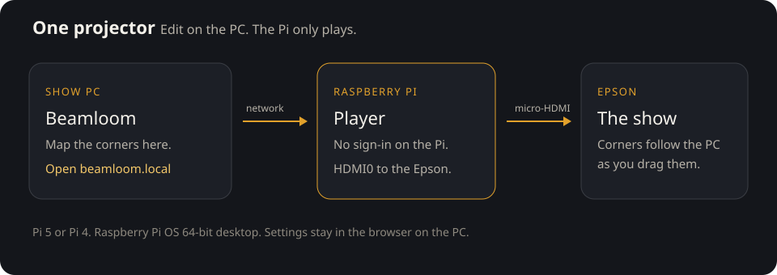
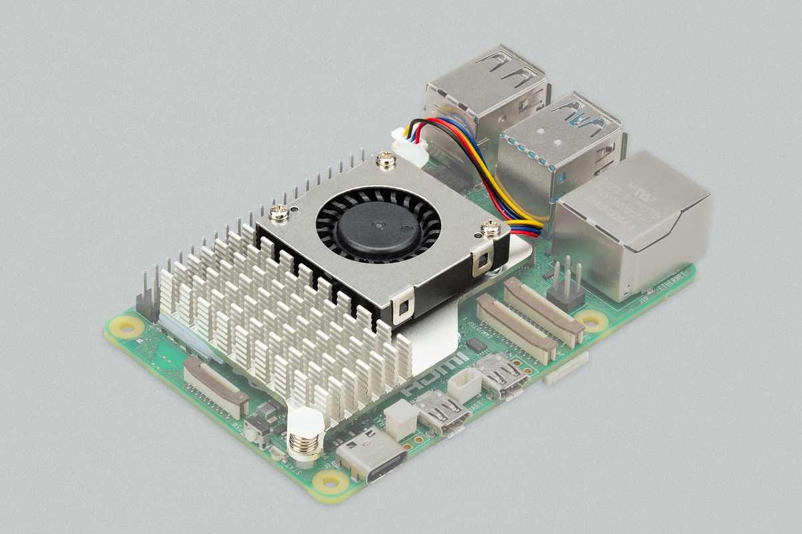
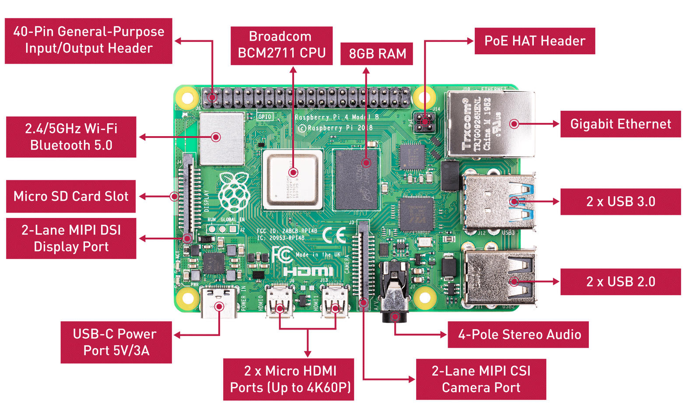
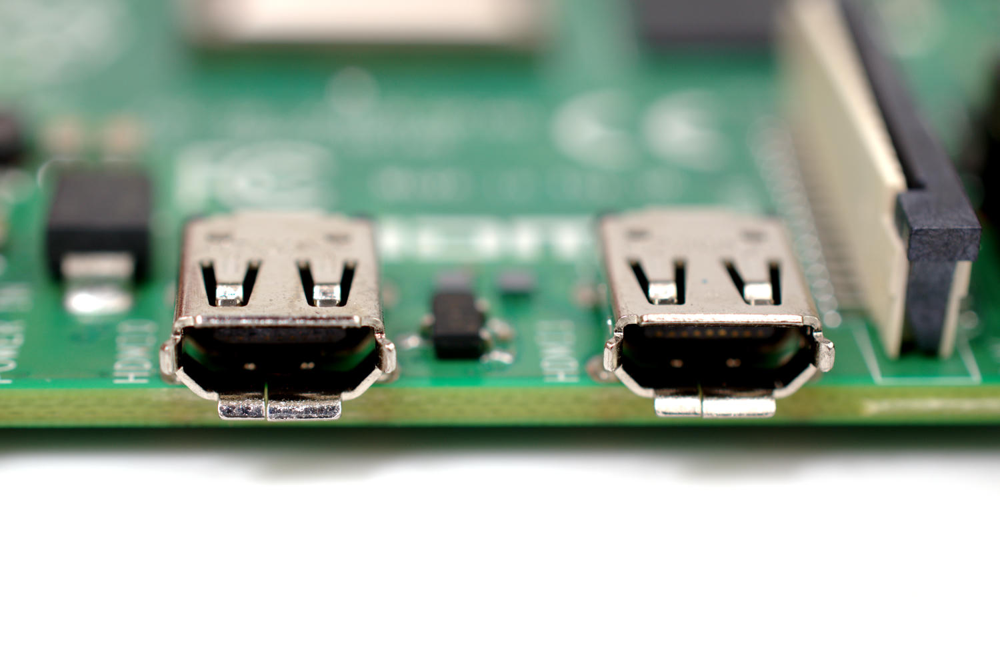
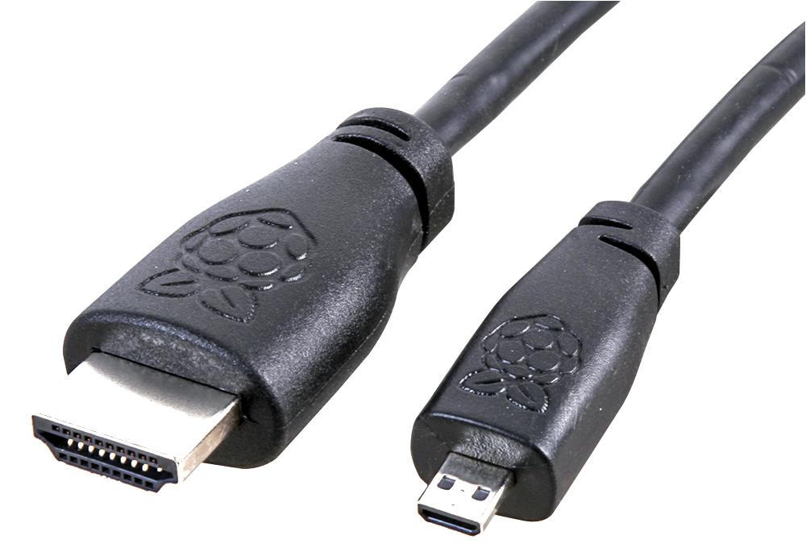

<p align="center">
  
</p>

# Beamloom

Beamloom is a house projection studio. You design the show on a Windows PC, then a Raspberry Pi plugged into the projector plays it. The PC is the editor. The Pi is the player, in the same role Falcon Player has for lights. After setup you do not sign in on the Pi. The picture goes out over HDMI, and the settings page is [http://beamloom.local/](http://beamloom.local/) on the PC.

## What it can do

- **Map the house.** Put a surface on a window, door, garage, or wall. Drag the four corners until the light sits on that part of the house. **Align surface** shows a bright shape so you can line it up while you watch the projector.
- **Follow a roofline.** Add up to 16 outline points so the light is not stuck as a rectangle. The four corners still set the perspective.
- **Play looks, photos, and video.** Each surface can use a built-in look, a PNG or JPEG, or a video. Window and arch masks, soft edge, opacity, brightness, contrast, and blend are per surface.
- **Run a show.** Scenes have their own timing. **Play show** loops them, with a cut or a fade up to two seconds. **Master** dims everything at once. **Solo** shows one surface. **Blackout** cuts the light.
- **Start from a pack.** Halloween, Christmas, New Year, Fourth of July, and Skeleton test ship with the app. Open one, then drag its windows and door onto your house.
- **Keep working when the PC is off.** **Send show** stores the project on the Pi. **Play stored show** loops it from the card, so the PC can close or shut down. **Start at dusk** uses the Pi's own clock: the stored show starts after sunset and stops at the time you set, with the PC off.
- **See the house while you edit.** In live setup the Pi shows the PC's picture right away. Move a corner or change a mask and the projector follows.
- **Listen to xLights or FPP.** A MultiSync start or sync steps the stored show. Stop turns the projector black. A surface can take four channels as red, green, blue, and brightness, or show a 32 by 18 DDP matrix inside the shape you mapped. The full steps are in [Connect xLights or FPP to mapped surfaces](#connect-xlights-or-fpp-to-mapped-surfaces).
- **Update without a new card.** The Windows app can download a newer installer. **Update Pi player** replaces the player program on the Pi. Raspberry Pi OS stays as it is.

One PC and one Pi on one projector is the setup that works today. Several Pis playing in lockstep is not built yet.

Add a surface to a projector frame, place its four corners over a wall, window, or other feature, and give it a built-in look, photo, or video. The separate projector window follows changes you make in the editor.

For live setup, select a surface and click **Align surface**. The projector or Pi shows a bright yellow shape with a white outline and corner marks. Drag corners in the editor while watching the light move on the house. **Stop Align** brings back the show; **Blackout** still turns the light off. Master brightness controls the test pattern. This mode is temporary and is not saved in the project.

**Trace a roofline or irregular object:** Select a surface, click a **+** at the middle of an edge to add an outline point, then drag its yellow dot. Use the white handles for the four placement corners; they still control the media's perspective. Add up to 16 outline points, remove individual points in the Shape section, or choose **Reset shape** to return to a rectangle. The outline is saved with the show and follows the surface into other scenes. For a show stored on the Pi, update its player before expecting the new outline to appear while the PC is off.

## Get started on Windows

**Desktop installer:** Download `Beamloom Setup.exe` from the latest [GitHub release](https://github.com/chadakenn/beamloom/releases/latest) and run it once. Open **Beamloom** from the Windows Start menu; pin that installed app to the taskbar or desktop if you want a shortcut. This version does not require Node.js. The installer is unsigned, so Windows may display a publisher warning. Connect your projector and set Windows to **Extend these displays**, then use **Output** in Beamloom to choose the display.

An installed copy checks the latest GitHub release a few seconds after it opens, then again every 30 minutes. When one exists, a bar at the top of the editor offers **Update**. The download starts only after you click it, and **Restart** appears when it is ready. The app shows its current version beside the Beamloom name. If the update fails, use **Get Setup.exe** to install the latest release manually; your saved project stays on this computer. If you see **running outside its Windows installation**, the shortcut opens a portable copy instead: run `Beamloom Setup.exe` and use the Start menu entry. `Start Beamloom.bat` runs the development copy and does not update itself. A new installer must be run once to get these improvements.

**From source:** Install [Node.js LTS](https://nodejs.org/) (version 22 or newer), download and extract this repository, and double-click `editor/Start Beamloom.bat`. The first launch installs dependencies and opens `http://127.0.0.1:4173/`. Keep the command window open while using Beamloom. If the browser cannot pick the projector automatically, open the output window, move it to the projector display, and make it fullscreen. Allow popups; fullscreen may need a click inside the output window.

For a quick office test, start with one projector or a second display. Add a surface, choose a look, drag its corners to fit something in the image, then try **Lineup** and **Blackout** before building a longer show.

## Build a show

- **Map surfaces:** Drag the four corners or enter their positions as percentages in the inspector. Choose a built-in look, import a PNG/JPEG, or import a video. Imported videos support play/pause, sound, loop, and scrubbing.
- **Shape the output:** Choose Full, Window, or Arch masking; adjust that surface's soft edge, opacity, brightness, contrast, saturation, and blend mode. Lock a surface to prevent accidental corner moves, or change its stacking order. Window and Arch use fixed mask shapes within the quad.
- **Layer effects:** Select a surface and click **Add layer on top** to put another effect over exactly the same corners. The new layer starts at 65% opacity with Screen blend; choose a different look or import media, then adjust its opacity and blend in the inspector. Move up/down changes draw order.
- **Line up the projector:** Guides, the lineup grid, center cross, and edge ticks help with placement. With Lineup on, corners snap to 10% grid lines; hold Alt to position freely. **Solo** displays only the selected surface, and **Blackout** immediately cuts the output to black.
- **Use scenes:** Add, rename, duplicate, or drag scene tabs to reorder them. Copy a single surface to another scene using the destination picker in its inspector; this keeps its corner positions and settings. Set a duration for each scene and use **Play show** to loop through the tabs. Set **Fade** from a cut to a two-second transition. **Master** dims every surface together, from 0% to 100%, without changing each surface's own brightness. The projector window follows it.
- **Keep alignments:** Save named presets of surface corner positions across the current scenes. Apply a preset to matching surfaces or update it after adjusting the corners.

Press **?** in the editor to see the available keyboard shortcuts. **Undo** and **Redo** are available in the toolbar. **Reset** asks for confirmation before replacing the current show with the sample project.

## Save and move projects

The editor saves the working project in local browser storage on this computer. Use **Save** to download a portable `.beamloom` file that includes the project and its used imported photos and videos. Use **Open** to load that file on another computer. Keep a copy of the file if the show matters: browser storage is tied to that browser and device.

Large videos produce large project files and need enough memory and local storage during import. Opening a project replaces the current editor project; other previously imported clips on the machine are retained. Alignment presets travel with the project. A newly added surface will not have saved corners in an older preset until you update that preset.

## Set up the Pi

<p align="center">
  
</p>

Beamloom stays on the Windows PC. The Pi does not run the editor. After it is set up, you do not sign in on the Pi. The Epson shows the output, and the settings page is **[http://beamloom.local/](http://beamloom.local/)** on the show PC. This is the same idea as Falcon Player's `fpp.local`, built as Beamloom's own player.

**Pi and LAN viewer media:** While the Windows PC is on and Pi output is running, imported PNG and JPEG images up to 25 MB, and MP4, WebM, or MOV videos up to 512 MB, show inside their mapped surfaces. The file stays on the PC and is served over the local network. It is not copied onto the Pi. Play, pause, and scrub follow the PC. The projector stays quiet; sound remains on the PC. A larger file, or a video in another format, still shows its built-in look.

The SD card uses the ready-made Beamloom Pi image. Download it from [Build Pi image on GitHub Actions](https://github.com/chadakenn/beamloom/actions/workflows/pi-image.yml), then follow the steps below. You do not need to run any commands on the Pi.

### 1. Pick the board

<p align="center">
  
</p>

<p align="center"><em>A Pi 5 is the one to get. The cooler in this photo is the official one.</em></p>

| Board | Use it? | Power and video |
| --- | --- | --- |
| Raspberry Pi 5 | Yes. Best choice. | 4 GB or more. Official 27 W USB-C supply. Two micro-HDMI ports. |
| Raspberry Pi 4 Model B | Yes. | 2 GB works. 4 GB is easier. Official 15 W USB-C supply. Two micro-HDMI ports. |
| Raspberry Pi 400 or 500 | Yes. | Keyboard models. Check whether that model's video plug is micro-HDMI or full-size HDMI. |
| Raspberry Pi 3, Pi Zero, Compute Module | No. | Too slow, too small, or not a normal board with HDMI. |

<p align="center">
  
</p>

<p align="center"><em>On a Pi 4, power is the USB-C port. The two small video ports are micro-HDMI. The card slot is on the left.</em></p>

### 2. Write the card

1. Open [Build Pi image](https://github.com/chadakenn/beamloom/actions/workflows/pi-image.yml) and click the newest run with a **green check mark**. If GitHub asks you to sign in to download, sign in first.
2. At the bottom of that run's page, under **Artifacts**, click **Beamloom-Pi-image**. This downloads `Beamloom-Pi-image.zip`.
3. **Extract `Beamloom-Pi-image.zip`** on your PC. Inside is another zip named `image_...-beamloom.zip`. Keep this **inner zip**; it is the one to flash.
4. Install and open [Raspberry Pi Imager](https://www.raspberrypi.com/software/). Choose your Pi model. For the operating system, choose **Use custom** and select the **inner** `image_...-beamloom.zip` from step 3. Do not choose Raspberry Pi OS from the list or the outer `Beamloom-Pi-image.zip`.
5. Insert a **32 GB or larger microSD card** into the PC, select that card in Imager, and click **Write**. Double-check that you selected the microSD card: writing erases it. When Imager finishes, remove the card and put it in the Pi.

You do not need to enter a username or home Wi-Fi in Imager. The card already contains Beamloom. If the download is gone, the repository owner needs to run **Build Pi image** again.

The image is Raspberry Pi OS Lite, 64-bit, Debian 13 Trixie, with the player already installed. SSH is off. If a keyboard is ever plugged in, the emergency account is `beamloom` and the password is `beamloom-player`. Day to day you only use the browser.

The downloadable image sets the Wi-Fi country to **US**. Outside the US, build an image with your local `WPA_COUNTRY` before using its wireless setup network.

### 3. Cable the Epson

The Pi's video plug is smaller than the Epson's. You need a **micro-HDMI to HDMI** cable. The small end goes in the Pi. The large end goes in the projector.

<p align="center">
  
  
</p>

<p align="center"><em>Use HDMI0, the socket next to the USB-C power port. The small plug is the Pi end.</em></p>

1. Plug the cable into the Pi, then into the Epson.
2. On the Epson, select that HDMI input.
3. Power the Pi from its official USB-C supply, not a phone charger.
4. Ethernet is optional. If you plug the Pi into the router, skip the setup network below.

### 4. Give it your Wi-Fi

This works like Falcon Player. If the Pi is not on Ethernet and does not already know a network, it starts its own.

1. On the show PC, join the Wi-Fi network **Beamloom**. The password is **beamloom**.
2. Open **http://192.168.4.1/**.
3. Enter your home Wi-Fi name and password and press **Join Wi-Fi**. Leave the password empty only if that network is open.
4. The setup network turns off. Rejoin your home Wi-Fi.

The home password is given to the Pi and is not saved in the Beamloom project. Anyone on the setup network can open the page, so use it only while you are standing there. Do not forward it to the internet.

If no Beamloom network appears, connect the Pi to your router with Ethernet and try `http://beamloom.local/` from your PC. On older images a text login screen can mean the projector display failed to start; once connected to the Pi settings page, check **Projector status** for the error. A new image is needed if its startup files are outdated; the player update button cannot replace those files.

### 5. Open the player

Back on your home Wi-Fi:

1. Open Beamloom on a PC connected to the same home Wi-Fi or Ethernet as the Pi. Allow Beamloom on **private networks** if Windows asks.
2. Click **Pi**, then open **Pi online/offline**. Beamloom looks on this network for a Raspberry Pi running the player and fills in its address. If more than one Pi is on, pick the one you want. Click **Search again** if it does not appear. If it is still missing, get its IP address from your router and type it in **Pi address**.
3. Click **Connect this Pi**. Beamloom starts live output, asks the Pi to check the connection, and saves the working PC address on the Pi. Follow the five-step checklist until it shows a live picture.
4. Drag a corner in Beamloom. The Pi screen should follow. **Master** and **Blackout** follow too.

**If Connect this Pi is not available on an older player:** Open **[http://beamloom.local/](http://beamloom.local/)**, or open the Pi IP from your router. On its settings page, enter the PC address shown by Beamloom, such as `http://192.168.1.20:8751/?player=1`. Click **Test PC connection**, then **Save PC address**. An older Pi page may show only **Save**. If the Pi stays at a text boot screen after saving, restart it once. When Beamloom reports **1 live viewer**, the Pi is showing its output.

If the connection test fails, make sure the PC and Pi are on the same home network, temporarily disconnect a VPN that routes local traffic, and allow inbound TCP port **8751** for Beamloom in Windows Firewall. The Pi settings page shows its Wi-Fi, saved PC address, and display status; use **Restart display** if the display is stuck. Your PC needs to remain on for the live picture. **Send show** copies the mapped project and its photos and videos onto the Pi. After that, the Pi loops the stored show on the projector when the PC is off. **Play stored show** keeps that loop running even while the PC is on. **Halloween**, **Christmas**, **New Year**, **Fourth of July**, and **Skeleton test** ship with the app. Open one from Included shows, then drag its windows, door, garage, and trim onto the house. Skeleton test is an original window show: bones, ghosts, fire, spiders, pumpkin faces, then a figure crossing. It is not a copy of anyone else's video.

The Pi settings page and the PC live page are open to anyone on the same network. While Pi output runs, imported photos and videos used in the show are served from the PC to LAN viewers. Keep this on a trusted home/show network, do not forward either device to the internet, and click **Stop Pi** when finished.

The Windows app's **Pi online** indicator shows the Pi's response time and the number of live viewers. Open it to change the Pi address. **Update Pi player** installs a published GitHub release, and it names that version before it starts. It replaces only the player program, not the Pi startup files and not Raspberry Pi OS. If the new player does not answer, the Pi puts the previous one back. The PC and the Pi both need internet for the update.

## Connect xLights or FPP to mapped surfaces

First complete **Set up the Pi** above. Run the current Windows installer and update the Pi player from the Beamloom **Pi online** menu after a release containing the xLights features is published. An older Pi image can use **Update Pi player**; it does not need to be flashed again. Leave the PC and Pi on the same home/show network. You can keep the Pi on Wi-Fi for a bench test; Ethernet is a good choice for a permanent show. If its IP changes, update both Beamloom's **Pi address** and the xLights controller address. You can test everything on a monitor connected to the Pi before connecting a projector.

There are two ways to use xLights:

| What xLights sends | Beamloom surface setting | Result |
| --- | --- | --- |
| Four E1.31 channels | **FPP / xLights color → Assign channels** | One solid red/green/blue color and brightness per surface. |
| A 128 × 72 or 256 × 144 DDP matrix | **xLights matrix → Use DDP matrix** | Moving xLights effects and the xLights Video effect inside a mapped surface. |

You can close the Windows app and xLights will keep playing on the Pi. The Pi uses the stored show for the window shapes, so press **Send show** after you turn the matrix or channel assignment on. If no show is stored yet, a live matrix still fills the projector. While Beamloom is open, the Pi keeps showing the live PC picture.

### Solid colors: first surface

1. In Beamloom, select a surface, click **Assign channels**, and set **Universe 1** and **Start channel 1**. Channels **1, 2, 3, 4** are red, green, blue, brightness. Keep channel 4 above zero to see the color.
2. In xLights **Controllers**, click **Add Ethernet**. Choose **E1.31**, turn **Multicast off**, enter the **Pi's IP address** (not the Windows PC's), set **Start Universe 1**, **Universe Count 1**, and **Channels per Universe 510**. Save. You do not need **Upload Output** to use the Beamloom player.
3. Check the controller list: the Pi controller should show **Channels [1–510]**. If another empty controller without an IP occupies [1–510], remove that unused controller and save. An inactive controller can still reserve those channel numbers.
4. For a quick test, choose **Tools → Test**, turn on **Output To Lights**, and select **only channels 1 and 4**. In **Standard → Background Only**, set background intensity to **255**: the surface should be red. Select **2 and 4** for green, or **3 and 4** for blue. Turn off the test output before starting a sequence.
5. To make a sequence, add a **DMX → General** model in xLights Layout. Name it `Beamloom test`, set **# Channels** to **4**, and confirm its **Start Channel is 1**. If it starts elsewhere, set **Controller → Use Start Channels**, then click the start-channel **…** button and select **Universe 1, channel 1** or **Absolute channel 1**. Leave the model's Red/Green/Blue Channel properties at their defaults; the **DMX effect** below controls the channels directly.
6. Choose **File → New Sequence → Animation Sequence**. Add the model to the sequencer view if needed. Drag a **DMX effect** onto its row (not the timing row). Set its four channel values to **255, 0, 0, 255** for red. Add another DMX effect with **0, 255, 0, 255** for green, then **0, 0, 255, 255** for blue. Save the sequence, enable **Output To Lights**, and press **Play**.

To control a second surface independently, set its Beamloom start channel to **5** and create another four-channel xLights DMX General model starting at **channel 5**. A DMX effect on that model still displays channels 1–4 in its settings; they output to actual channels **5–8**. Starting channels can be 1–509 so four values fit in one E1.31 universe. You can keep adding four-channel surfaces in the same way.

### Moving effects and video: one matrix picture

1. Keep the E1.31 controller above if you want solid-color surfaces too. In xLights **Controllers**, add a **second Ethernet controller** with **Protocol DDP** and the **same Pi IP address**. It needs **27648 channels** (128 × 72 × 3); leave **Channels Per Packet** at **1440**. Turn **Keep Channel Numbers off** so this DDP controller's first pixel starts at channel 1 *in its DDP packets*, even if an E1.31 controller occupies earlier xLights channel numbers. Save. Beamloom detects the DDP destination ID automatically.
2. In xLights **Layout**, create a **Horizontal Matrix** model. Set **# Strings = 72**, **Nodes/String = 128**, **Strands/String = 1**, **Starting Location = top left**, and **Don't Zig Zag = on**. Assign it to the DDP controller, set **Controller Connection → Port 1**, and save. Check the DDP controller shows **27648 channels**. Auto Size computes this when the model has a valid port.
3. In Beamloom, select the surface that should show the effect and click **Use DDP matrix**. Leave the Pi displaying the PC live show, or send the Beamloom show to the Pi for stored-show playback. The Windows editing preview does not display incoming Pi pixels; watch the Pi's HDMI display.
4. In an xLights sequence, drag an effect onto the matrix model, enable **Output To Lights**, and press **Play**. To try video, use xLights' **Video** effect on the matrix row and choose its video file. Keep xLights or FPP sending DDP while you want to see the effect.

Matrix mode shows **one shared picture**. Enabling it on more surfaces mirrors that picture. It stays inside each surface's existing corners, mask, feather, and grading. When DDP stops for five seconds, the surface returns to its Beamloom look or imported media. **128 × 72** is the lighter option. For clearer video, set the same xLights matrix to **# Strings 144**, **Nodes/String 256**, **Strands/String 1**, **Port 1**, and leave **Don't Zig Zag on**. Save and check the DDP controller shows **110592 channels**. The Pi automatically accepts either size; Beamloom does not need a per-surface resolution setting. The 256 × 144 mode sends four times as much pixel data as 128 × 72, so use Ethernet on the Pi and PC for a steady show. If video stutters, restore 72 strings and 128 nodes/string. This mode does not receive sound from xLights.

At 256 × 144, the Pi limits browser updates to about 12 frames per second and skips older frames if xLights sends them faster. The smaller matrix can refresh more often. If the Pi picture lags badly or Chromium shows a crashed-page icon, switch xLights back to 72 strings × 128 nodes/string, save, and restart the Pi if the browser did not recover. The larger size still sends 77 DDP packets per xLights frame, so a wired connection matters even with browser pacing.

**Upgrading an existing 32 × 18 setup:** Keep your current xLights matrix until the new Pi player release is installed (use **Update Pi player**, no SD card reflash). Then edit that matrix to **# Strings 72** and **Nodes/String 128**, keep **Port 1** and **Don't Zig Zag on**, save the xLights layout and controllers, and check the DDP controller shows **27648 channels**. With the updated player, the old 32 × 18 matrix no longer forms a complete picture until you resize it. If xLights warns while starting Output To Lights, check for duplicate E1.31 controllers using the same Pi IP and universe; only one is needed for channels 1–510.

### If nothing appears

- **Pi online, no xLights color:** Recheck the Pi IP in the E1.31 controller, turn **Multicast off**, confirm the surface's universe/start channel, and make sure the fourth brightness channel is above zero. Try the individual channel test before sequence playback. The Pi receives unicast E1.31 on **UDP 5568**.
- **xLights says “Error opening output 1 0”:** Check **Controllers** for an extra active E1.31 controller with no IP. Remove the unused row, save, and confirm the Pi controller starts at **[1–510]**. Close **Tools → Test** before replaying the sequence.
- **RGB test works but matrix does not:** Confirm the DDP controller points to the Pi, **Keep Channel Numbers is off**, the matrix uses either 128 × 72 RGB nodes and 27648 channels or 256 × 144 RGB nodes and 110592 channels, and xLights sends **UDP 4048**. The Pi must have a player release supporting the chosen size; your old RGB test alone does not prove that update installed.
- **The effect looks mirrored or scrambled:** Verify **top left**, **horizontal**, and **Don't Zig Zag** in the xLights matrix model. Use xLights' node layout to check rows run left to right.
- **Colors freeze or drop:** Try Ethernet if available. Confirm xLights **Output To Lights** is on and the PC has not gone to sleep. Beamloom deliberately reverts to its normal look after five seconds without data.

**FPP playback:** The Pi listens for FPP MultiSync on **UDP 32320** (unicast or multicast `239.70.80.80`). If a Beamloom show was sent to the Pi, MultiSync start/sync can step its scenes to the packet's elapsed time, and stop blacks out the stored show. If PC live output is selected, the live picture wins. E1.31 and DDP provide the colors/pixels; MultiSync by itself does not carry video or matrix frames. The Pi does not join sACN multicast universes. Up to 32 active E1.31 universes are forwarded to the Pi browser at once. These network features use a trusted local network; do not expose the Pi or the PC live page to the internet.

You can open the same PC address in a browser on the PC before the Pi is ready. That checks the live page without the projector.

## Develop from source

```bash
cd editor
npm ci
npm run dev
```

The development server listens on `http://127.0.0.1:4173/`. From `editor/`, run `npm run build` to type-check and build the web app. On Windows, `npm run make:win` builds the desktop installer in `editor/out/make/squirrel.windows/x64/`. The **Windows installer** workflow can also be started manually in GitHub Actions; it uploads the installer as an artifact. **Publish Windows release** uploads that installer, `RELEASES`, and the `.nupkg` to a GitHub Release. The release tag must be the version in `editor/package.json`, such as `0.1.1`, with no `v` in front.

| Path | Purpose |
| --- | --- |
| `editor/src/lib/beam/project.ts` | Project, scenes, surfaces, and saved project data |
| `editor/src/lib/beam/store.ts` | Editor actions and undo history |
| `editor/src/lib/beam/gl-mapper.ts` | WebGL rendering, quad mapping, and masks |
| `editor/src/lib/beam/clips.ts` | Imported media and playback |
| `editor/src/lib/beam/project-file.ts` | Portable project save/open |
| `editor/src/lib/beam/displays.ts` | Projector display selection |
| `editor/src/components/studio/` | Editor, projector frame, and inspector |
| `editor/electron/` | Windows desktop window and display integration |
| `player/` | Pi player settings page and boot services |

Beamloom's interface, looks, and mapping code are original to this project. Do not add assets, presets, or decompiled code from commercial mapping tools.

## License

MIT. See [LICENSE](LICENSE).
